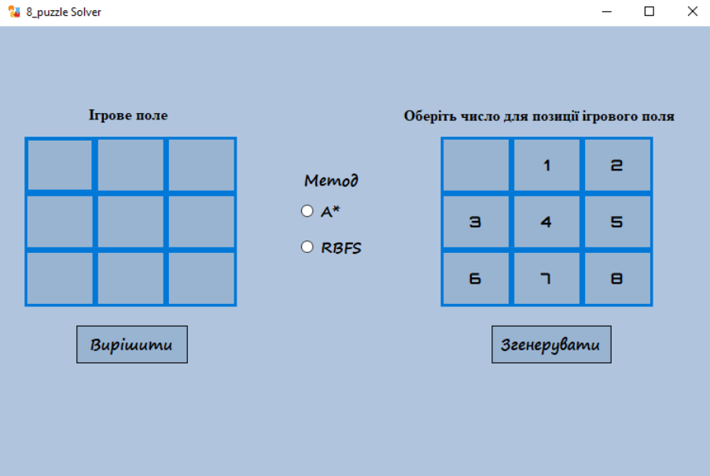
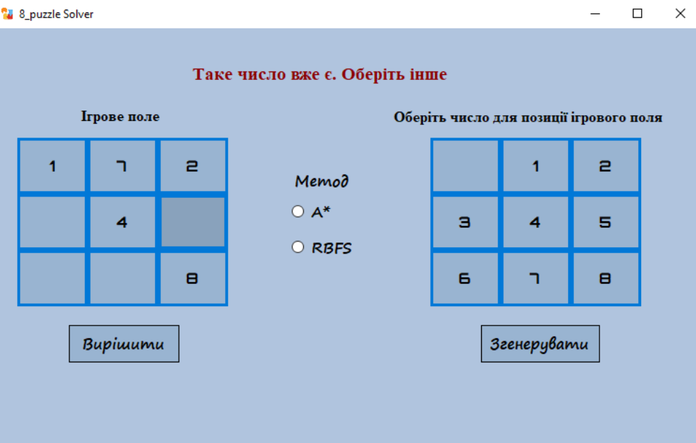

# 8-Puzzle Solver — A* & RBFS

A Windows desktop app that solves the classic 8-puzzle problem using two informed search algorithms, A* and RBFS (Recursive Best-First Search), with the Manhattan distance heuristic. Built with C++/CLI and Windows Forms.

This project was developed as my first university coursework.

## Preview

| Setting up a puzzle                              | Duplicate value validation                             |
| ------------------------------------------------ | ------------------------------------------------------ |
|  |  |

## Features

- Switch between A* and RBFS to compare how each performs on the same puzzle.
- Build a custom starting position by picking a number and placing it on the board, or generate a random one.
- Duplicate-value protection and a way to clear a cell back to blank.
- Checks the puzzle is solvable before searching, and reports it if not.
- Animated step-by-step playback of the solution, plus a node count for the search.
## How it works

1. Generate a random puzzle, or build one manually by picking a number and clicking a board cell.
2. Choose a method — A* or RBFS.
3. Solve. The board then animates through the solution, and the node count is shown.

## Tech stack

- **C++/CLI** (managed C++) — the algorithm and board logic are plain C++, wrapped in a managed layer for Windows Forms interop.
- **Windows Forms** — UI framework, requires the .NET Framework (Windows only).
- **MSVC** — this project relies on the `/clr` compiler flag, which is MSVC-specific; it cannot be built with GCC/Clang.

## Project structure

```
coursework/
├── algorithms/ # A* and RBFS implementations
├── model/ # Board representation
├── UI/ # Windows Forms interface
├── docs/ # User manual (Ukrainian)
└── README.md
```

## Building

Requires Visual Studio (Desktop development with C++ workload, with the C++/CLI support component) — this is a Windows-only, MSVC-only project. Open the folder in Visual Studio, restore/generate the `.sln`/`.vcxproj` if needed, and build.